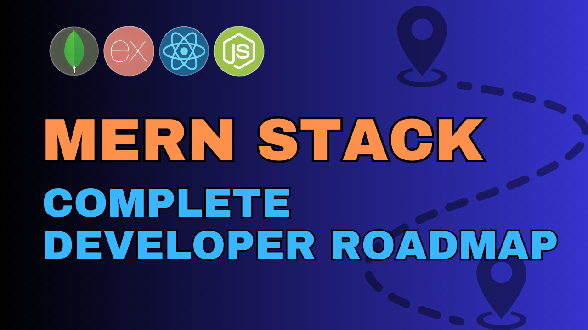
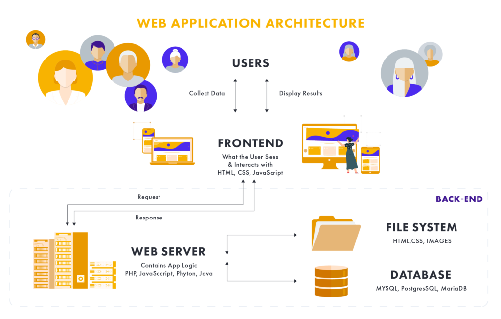

# MERN Stack Roadmap – How to Learn MERN and Become a Full-Stack Developer

1. How you can learn and master the technologies that you can use to build your own full stack projects from scratch?

[Full Stack Developer Roadmap](https://roadmap.sh/full-stack)

1.  HTML, CSS, JavaScript (Basic Technologies for Web)

2.  Backend - Node.js, Express

3.  NoSQL Database - MongoDB

4.  Frontend Library - React.js (Components , State (Redux, Recoil))

5.  CSS Library - Tailwind CSS, Radix UI, Shadcn

6.  Build projects, commit to GitHub, organize your README file, add a live link to your website. (Deploying it on the internet)

7.  The MERN stack is great, but we still need to know containerization and auto-scaling (things we will learn in DevOps)

8.  DevOps Responsibilities typically include automating processes, managing and deploying code, monitoring performance, ensuring security, and enabling continuous integration/continuous deployment (CI/CD) pipelines. DevOps professionals work with tools for containerization (e.g., Docker, Kubernetes) and cloud services (e.g., AWS, Azure) to enhance scalability, efficiency, and reliability of software applications.

### FRONTEND VS BACKEND

## How to use our LMS

[Velisa Africa - LMS](https://www.e5code.com/)

2. The course can benefit the following groups of people.

- Everyone who wants to learn web development: Whether you're a beginner or looking to expand your skills, this course covers essential topics in web development.

- MERN stack enthusiasts: Those interested in learning the MongoDB, Express, React, and Node.js stack will find this course particularly useful.

- JavaScript programmers: If you want to deepen your understanding of JavaScript and its applications in web development, this course is for you.

- Computer science students: Both current students and recent graduates can benefit from this course. It provides practical skills that complement theoretical knowledge, helping you prepare for job opportunities before graduation and enhancing your current studies.
