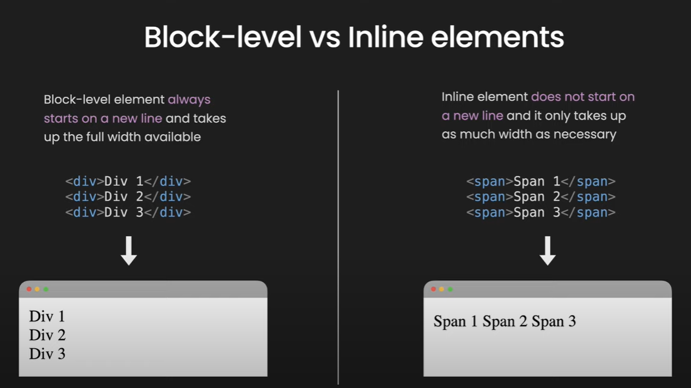
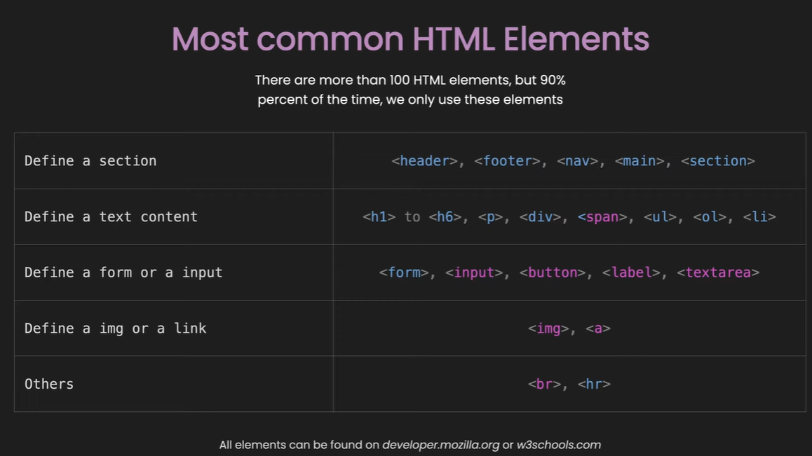

# HTML - Hypertext Markup Language

- Describes the structure of a Web page

# Video

**Two things you must understand in high level**

1. Tags - (h1, h2, p, span)

2. Attributes

```html
<p id="demo">This is paragraph</p>
```

**What is HTML?**

- HTML stands for Hyper Text Markup Language
- HTML is the standard markup language for creating Web pages
- HTML describes the structure of a Web page
- HTML consists of a series of elements
- HTML elements tell the browser how to display the content
- HTML elements label pieces of content such as "this is a heading", "this is a paragraph", "this is a link", etc.

## HTML page

```
<!DOCTYPE html>
<html>
<head>
<title>Page Title</title>
</head>
<body>

<h1>This is a Heading</h1>
<p>This is a paragraph.</p>
<ul>
<li>One</li>
<li>Two</li>
<li>Three</li>
</ul>

<ol>
<li>One</li>
<li>Two</li>
<li>Three</li>
</ol>


<a href="link">Home</a>

<hr />

<br />


</body>
</html>

```


## Empty Element

Insert or Embed something in the document
`<input>, , <br>, <hr>, <embed>, <meta>, <link>`

## Nesting

HTML elements can be nested

```
    <div class="list">
    <h2>My List: </h2>
    <ul>
        <li>Apple</li>
        <li>Mango</li>
        <li>Banana</li>
    </ul>
    </div>

```

## Attributes

Attributes contain extra information about the element that won't appear in the content

``

- All HTML elements can have attributes
- Attributes provide additional information about elements
- Attributes are always specified in the start tag
- Attributes usually come in name/value pairs like: name="value"

## Boolean Attributes

- some attributes can be written without value eg. disabled is boolean attributes
  `<button onclick="alert("button clicked") disabled="disabled">Button Click</button>`
  `<button onclick="alert("button clicked") disabled >Button Click</button>`

## Most common HTML Elements

There are hundreds of HTML elements, most of the time we only use these elemets.

### Define a section: `<header>, <footer>, <nav>, <main>, <section>, <div>`

### Define a text content: `<h1> to <h6>, <p>, <span>, <ul>, <li>, <ol>`

### Define a form or a input: `<form>, <input>, <button>, <lable>, <textarea>`

### Define a img or a link: `, <a>`

### Others: `<hr >, <br>`

## Block-level vs inline elements



## Most common inline elements are colored.



## Description about tags in head section


## Practice how inline and block element behave.

## Best Practice -sample code from freecode camp

```
<body>
    <main>
      <h1>CatPhotoApp</h1>
      <section>
        <h2>Cat Photos</h2>
        <!-- TODO: Add link to cat photos -->
        <p>See more <a target="_blank" href="https://freecatphotoapp.com">cat photos</a> in our gallery.</p>
        <a href="https://freecatphotoapp.com"></a>
      </section>
      <section>
        <h2>Cat Lists</h2>
        <h3>Things cats love:</h3>
        <ul>
          <li>cat nip</li>
          <li>laser pointers</li>
          <li>lasagna</li>
        </ul>
        <figure>
          
          <figcaption>Cats <em>love</em> lasagna.</figcaption>
        </figure>
        <h3>Top 3 things cats hate:</h3>
        <ol>
          <li>flea treatment</li>
          <li>thunder</li>
          <li>other cats</li>
        </ol>
        <figure>
          
          <figcaption>Cats <strong>hate</strong> other cats.</figcaption>
        </figure>
      </section>
      <section>
        <h2>Cat Form</h2>
        <form action="https://freecatphotoapp.com/submit-cat-photo">
          <fieldset>
            <legend>Is your cat an indoor or outdoor cat?</legend>
            <label><input id="indoor" type="radio" name="indoor-outdoor" value="indoor" checked> Indoor</label>
            <label><input id="outdoor" type="radio" name="indoor-outdoor" value="outdoor"> Outdoor</label>
          </fieldset>
          <fieldset>
            <legend>What's your cat's personality?</legend>
            <input id="loving" type="checkbox" name="personality" value="loving" checked> <label for="loving">Loving</label>
            <input id="lazy" type="checkbox" name="personality" value="lazy"> <label for="lazy">Lazy</label>
            <input id="energetic" type="checkbox" name="personality" value="energetic"> <label for="energetic">Energetic</label>
          </fieldset>
          <input type="text" name="catphotourl" placeholder="cat photo URL" required>
          <button type="submit">Submit</button>
        </form>
      </section>
    </main>
    <footer>
      <p>
        No Copyright - <a href="https://www.freecodecamp.org">freeCodeCamp.org</a>
      </p>
    </footer>
  </body>
</html>

```

## Registration form

- index.html

```
<!DOCTYPE html>
<html lang="en">
  <head>
    <meta charset="UTF-8">
    <title>Registration Form</title>
    <link rel="stylesheet" href="styles.css" />
  </head>
  <body>
    <h1>Registration Form</h1>
    <p>Please fill out this form with the required information</p>
    <form method="post" action='https://register-demo.freecodecamp.org'>
      <fieldset>
        <label for="first-name">Enter Your First Name: <input id="first-name" name="first-name" type="text" required /></label>
        <label for="last-name">Enter Your Last Name: <input id="last-name" name="last-name" type="text" required /></label>
        <label for="email">Enter Your Email: <input id="email" name="email" type="email" required /></label>
        <label for="new-password">Create a New Password: <input id="new-password" name="new-password" type="password" pattern="[a-z0-5]{8,}" required /></label>
      </fieldset>
      <fieldset>
        <label for="personal-account"><input id="personal-account" type="radio" name="account-type" class="inline" /> Personal Account</label>
        <label for="business-account"><input id="business-account" type="radio" name="account-type" class="inline" /> Business Account</label>
        <label for="terms-and-conditions">
          <input id="terms-and-conditions" type="checkbox" required name="terms-and-conditions" class="inline" /> I accept the <a href="https://www.freecodecamp.org/news/terms-of-service/">terms and conditions</a>
        </label>
      </fieldset>
      <fieldset>
        <label for="profile-picture">Upload a profile picture: <input id="profile-picture" type="file" name="file" /></label>
        <label for="age">Input your age (years): <input id="age" type="number" name="age" min="13" max="120" /></label>
        <label for="referrer">How did you hear about us?
          <select id="referrer" name="referrer">
            <option value="">(select one)</option>
            <option value="1">freeCodeCamp News</option>
            <option value="2">freeCodeCamp YouTube Channel</option>
            <option value="3">freeCodeCamp Forum</option>
            <option value="4">Other</option>
          </select>
        </label>
        <label for="bio">Provide a bio:
          <textarea id="bio" name="bio" rows="3" cols="30" placeholder="I like coding on the beach..."></textarea>
        </label>
      </fieldset>
      <input type="submit" value="Submit" />
    </form>
  </body>
</html>


```

- style.css

```
body {
  width: 100%;
  height: 100vh;
  margin: 0;
  background-color: #1b1b32;
  color: #f5f6f7;
  font-family: Tahoma;
  font-size: 16px;
}

h1, p {
  margin: 1em auto;
  text-align: center;
}

form {
  width: 60vw;
  max-width: 500px;
  min-width: 300px;
  margin: 0 auto;
  padding-bottom: 2em;
}

fieldset {
  border: none;
  padding: 2rem 0;
  border-bottom: 3px solid #3b3b4f;
}

fieldset:last-of-type {
  border-bottom: none;
}

label {
  display: block;
  margin: 0.5rem 0;
}

input,
textarea,
select {
  margin: 10px 0 0 0;
  width: 100%;
  min-height: 2em;
}

input, textarea {
  background-color: #0a0a23;
  border: 1px solid #0a0a23;
  color: #ffffff;
}

.inline {
  width: unset;
  margin: 0 0.5em 0 0;
  vertical-align: middle;
}

input[type="submit"] {
  display: block;
  width: 60%;
  margin: 1em auto;
  height: 2em;
  font-size: 1.1rem;
  background-color: #3b3b4f;
  border-color: white;
  min-width: 300px;
}

input[type="file"] {
  padding: 1px 2px;
}
a {
    color: #dfdfe2;
}
```

## Form

- An HTML form is used to collect user input. The user input is most often sent to a server for processing.

### The form Element

- The **form** element is a container for different types of input elements, such as: text fields, checkboxes, radio buttons, submit buttons, etc.

```
- <input type="text"> Displays a single-line text input field
- <input type="radio"> Displays a radio button (for selecting one of many choices)
- <input type="checkbox"> Displays a checkbox (for selecting zero or more of many choices)
- <input type="submit"> Displays a submit button (for submitting the form)
- <input type="button"> Displays a clickable button
```

### Create basic html page structure for below Projects, Try to use semantic tags as possible. css not required.

Just create the structure of the page.

# Demo

- Just create basic structure for home page (html only)

  [Zerodha homepage](https://zerodha.com/)

# Project -1

- No css only structure of the page

[cake recipe](https://www.allrecipes.com/recipe/241038/microwave-chocolate-mug-cake/)

# Project - 2

- No css only structure of the page

[tribute-page](https://tribute-page.freecodecamp.rocks/)

# Project - 3

[Personal-portfolio](https://personal-portfolio.freecodecamp.rocks/)

# Project - 4

[product-landing-page](https://product-landing-page.freecodecamp.rocks/)

# Project - 5

[mytunes](https://jolly-kalam-23776e.netlify.app/mytunes/)

# Project - 6

[resturant-page](https://jolly-kalam-23776e.netlify.app/restaurantwebsite/)

# Project - 7

[photographysite](https://jolly-kalam-23776e.netlify.app/photographysite/#images)

# More project

[frontendmentor](https://www.frontendmentor.io/challenges?sort=difficulty|asc&types=free)

# Resoureces

[HTML Dog Tag List](http://www.htmldog.com/reference/htmltags/)
[W3Schools Tag List](http://www.w3schools.com/tags/default.asp)
[Quackit HTML Tag List](http://www.quackit.com/html/tags/)
