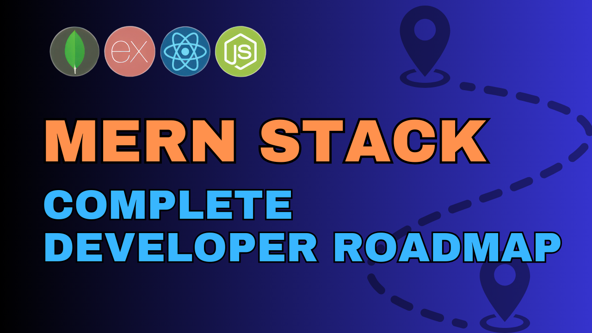

# MERN Stack Roadmap – How to Learn MERN and Become a Full-Stack Developer

1. How you can learn and master the technologies that you can use to build your own full stack projects from scratch?

[Full Stack Developer Roadmap](https://roadmap.sh/full-stack)

1.  HTML, CSS, JavaScript (Basic Technologies for Web)

2.  Backend - Node.js, Express

3.  NoSQL Database - MongoDB

4.  Frontend Library - React.js (Components , State (Redux, Recoil))

5.  CSS Library - Tailwind CSS, Radix UI, Shadcn

6.  Build projects, commit to GitHub, organize your README file, add a live link to your website. (Deploying it on the internet)

7.  The MERN stack is great, but we still need to know containerization and auto-scaling (things we will learn in DevOps)

8.  DevOps Responsibilities typically include automating processes, managing and deploying code, monitoring performance, ensuring security, and enabling continuous integration/continuous deployment (CI/CD) pipelines. DevOps professionals work with tools for containerization (e.g., Docker, Kubernetes) and cloud services (e.g., AWS, Azure) to enhance scalability, efficiency, and reliability of software applications.

### FRONTEND VS BACKEND

## How to use our LMS

[Velisa Africa - LMS](https://www.e5code.com/)
